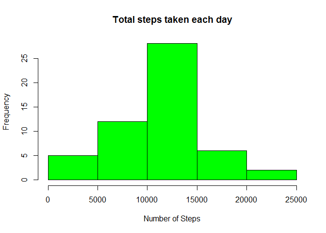
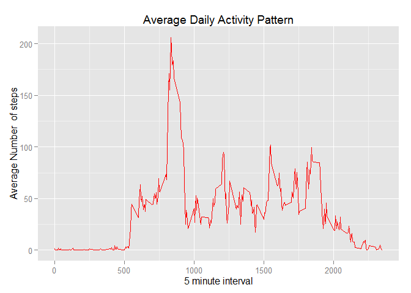
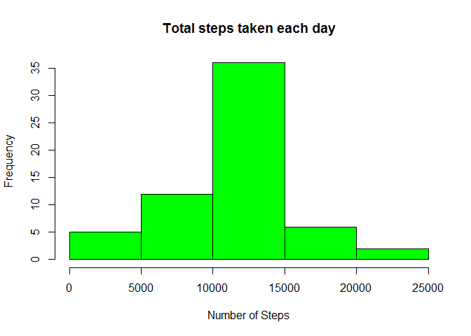
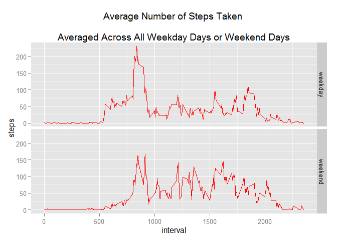

**Reproducible Research: Peer Assessment 1**
=================================================================================

##Loading and preprocessing the data##
1. Reading data from the current directory


```r
if(!file.exists("activity.csv")){
        unzip("activity.zip")
}

data_Activity <- read.csv("activity.csv",header = TRUE)
# convert in to date format
data_Activity$date <-as.Date(data_Activity$date)
summary(data_Activity)
```

```
##      steps             date               interval     
##  Min.   :  0.00   Min.   :2012-10-01   Min.   :   0.0  
##  1st Qu.:  0.00   1st Qu.:2012-10-16   1st Qu.: 588.8  
##  Median :  0.00   Median :2012-10-31   Median :1177.5  
##  Mean   : 37.38   Mean   :2012-10-31   Mean   :1177.5  
##  3rd Qu.: 12.00   3rd Qu.:2012-11-15   3rd Qu.:1766.2  
##  Max.   :806.00   Max.   :2012-11-30   Max.   :2355.0  
##  NA's   :2304
```

###What is mean total number of steps taken per day?###

1. Ignoring the Missing Values
2. Histogram Plotof the total number of steps taken each day
3. **Mean** and **Median** of the total number of steps taken each day


```r
TotalSteps<- aggregate(steps ~ date,
                       data = data_Activity, FUN=sum, na.rm=TRUE)
```

**Histogram Plot**

```r
hist(TotalSteps$steps, main = "Total steps taken each day",
     xlab = "Number of Steps",col = "green")
```

 

```r
mean_Steps <- mean(TotalSteps$steps)
mean_Steps
```

```
## [1] 10766.19
```

```r
median_steps <- median(TotalSteps$steps)
median_steps
```

```
## [1] 10765
```

Mean  and Median of the total number of steps taken each day is 1.0766189\times 10^{4} and 10765 respectively.

###What is the average daily activity pattern?###

1. Calculate the averages steps per interval each day


```r
steps_interval <- aggregate(steps ~ interval,
                            data = data_Activity, FUN = mean, na.rm=TRUE )
```

2. Time Series Plot of the 5-minute interval (x-axis) and the average number of steps taken, averaged across all days (y-axis)


```r
library(ggplot2)
g <- ggplot(steps_interval, aes(interval,steps))
g<- g + geom_line(color = "red")+ xlab("5 minute interval") + 
        ylab("Average Number  of steps") + ggtitle("Average Daily Activity Pattern")
g
```

 

3. Time interval which contains the maximum number of steps


```r
Max <- steps_interval[which.max(steps_interval$steps),]
Max$interval
```

```
## [1] 835
```

###Imputing missing values###

1. Total number of rows with missing values


```r
TotalSteps_Missing <-sum(is.na(data_Activity))
TotalSteps_Missing
```

```
## [1] 2304
```

2. Fill all the missing values with the mean of the interval and crete a new dataset 


```r
imputed_data <-
        transform(data_Activity, steps = 
                          ifelse(is.na(data_Activity$steps),
                                 steps_interval$steps[match(data_Activity$interval,steps_interval$interval)], 
                                 data_Activity$steps))
```

3. Histogram of the total number of steps


```r
TotalSteps_withNoMissing<- aggregate(steps ~ date,
                       data = imputed_data, FUN=sum, na.rm=TRUE)
```

**Histogram Plot**

```r
hist(TotalSteps_withNoMissing$steps, main = "Total steps taken each day",
     xlab = "Number of Steps",col = "green")
```

 

```r
mean_Steps_new <- mean(TotalSteps_withNoMissing$steps)
mean_Steps_new
```

```
## [1] 10766.19
```

```r
median_steps_new <- median(TotalSteps_withNoMissing$steps)
median_steps_new
```

```
## [1] 10766.19
```

- The new Mean  and Median of the total number of steps taken each day after imputing  is 1.0766189\times 10^{4} and 1.0766189\times 10^{4} respectively. 
- Difference between the mean of original and imputed data is

```r
diff_mean <- mean_Steps_new - mean_Steps
diff_mean
```

```
## [1] 0
```

- Difference between the median of original and imputed data is

```r
diff_median <- median_steps_new - median_steps
diff_median
```

```
## [1] 1.188679
```

###Are there differences in activity patterns between weekdays and weekends?###
1. Add the day coloumn to the imputed data
2. Factor the days in to weekdays and weekends

```r
imputed_data$day <- weekdays(as.Date(imputed_data$date))
weekdays1 <- c('Monday', 'Tuesday', 'Wednesday', 'Thursday', 'Friday')
imputed_data$wDay <- c('weekend', 'weekday')[(weekdays(imputed_data$date) %in% weekdays1)+1L]

imputed_data_sub <- aggregate(steps ~ interval + wDay, data = imputed_data, mean)
```

3. panel Plot of the 5-minute interval (x-axis) and the average number of steps taken, averaged across all weekday days or weekend days (y-axis)


```r
p <- ggplot(imputed_data_sub,aes(interval,steps))
p <- p + geom_line(color="red")  +
         facet_grid(wDay ~ .)+
        ggtitle("Average Number of Steps Taken 
       \nAveraged Across All Weekday Days or Weekend Days")
p
```

 

4. The average steps taken on weekends is more than the weekdays.
